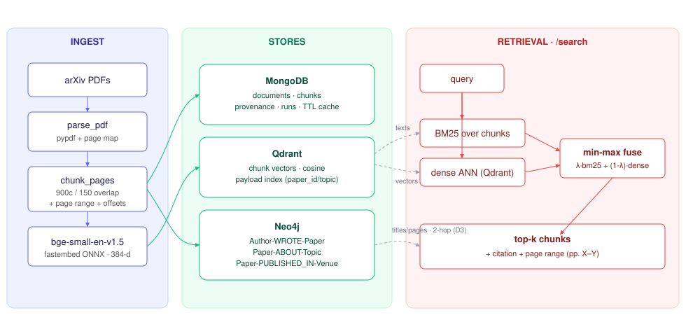

# D2 — Retrieval Stack & Graph Build

CSAI415 · *PDF-Papers AI Agent: Hybrid Retrieval + GraphRAG with Online Learning and AutoML*

**Team:** Khalifa · Meshal · Mahmoud · Ahmed · Essam

D2 builds the retrieval backbone the rest of the project sits on: a real
**PDF → text → chunks → embeddings** ingestion pipeline, three persistent stores
(**MongoDB**, **Qdrant**, **Neo4j**), a **hybrid BM25 + dense `/search`** API with
grounded citations and page ranges, and a **knowledge graph** with example Cypher.
It picks up directly from D1 — the hybrid `λ` is the D1 Optuna winner, and the
dense side is now the real `bge-small-en-v1.5` encoder D1 stubbed out.

## What's here

```
D2/
├── docker-compose.yml      ← Mongo + Qdrant + Neo4j (one command)
├── .env.example            ← store URLs + embedder + λ
├── requirements.txt
├── run_card.yaml           ← active config + corpus + headline results
├── diagram/
│   ├── dataflow.svg        ← ingest → stores → retrieval → graph
│   └── dataflow.mmd        ← same, mermaid source
├── data/
│   ├── papers.csv          ← 60-paper manifest (paper_id,title,authors,venue,year,pdf_url,pdf_path,topics)
│   └── pdfs/               ← downloaded arXiv PDFs (gitignored; regenerate)
├── src/
│   ├── config.py           ← env-driven settings (+ in-process fallbacks)
│   ├── ingest.py           ← parse_pdf (page map) + sliding-window chunker (+overlap)
│   ├── embedder.py         ← bge-small-en via fastembed/ONNX (+ offline hash embedder)
│   ├── hybrid_search.py    ← BM25 + dense fusion, citations w/ page ranges
│   ├── pipeline.py         ← wires stores + embedder + searcher; runs ingestion
│   ├── cypher_queries.py   ← 5 parameterised example Cypher queries
│   └── stores/
│       ├── mongo_store.py  ← documents/chunks/runs/cache(+TTL); pymongo | mongomock
│       ├── vector_store.py ← Qdrant: server | on-disk | :memory:
│       └── graph_store.py  ← Neo4j loader | NetworkX (same query API)
├── api/main.py             ← FastAPI: /search /ingest /stats /healthz /graph/related
├── scripts/
│   ├── download_pdfs.py    ← fetch arXiv PDFs + write papers.csv
│   ├── seed_stores.py      ← ingest → Mongo + Qdrant + Neo4j (docker path)
│   ├── eval_search.py      ← Recall@k / nDCG@k / latency + examples (docker path)
│   ├── seed_resumable.py   ← resumable on-disk seed (no-Docker / CI path)
│   └── eval_from_cache.py  ← evaluate from the resumable cache
├── results/                ← search_metrics.{json,md}, examples.md, graph_examples.md
└── tests/test_smoke.py     ← end-to-end pytest (in-process, offline embedder)
```

## Architecture



A query fans out to two retrievers — **BM25** over chunk text and **dense ANN**
over `bge` embeddings in Qdrant. Each side returns a candidate pool; the pools
are unioned, each signal is min-max normalised, and they are fused as
`λ·bm25 + (1−λ)·dense`. The top-k chunks come back with a citation built from
Mongo provenance (`title (paper_id), pp.X–Y`). The Neo4j graph supports
metadata queries now and the 2-hop subgraph expansion GraphRAG will use in D3.

## Quick start (one command for stores)

```bash
cd D2
cp .env.example .env                 # adjust if needed
docker compose up -d                 # Mongo:27017  Qdrant:6333  Neo4j:7474/7687
pip install -r requirements.txt

# load env so the code targets the services (not the fallbacks)
set -a && source .env && set +a

python scripts/download_pdfs.py --per-topic 10   # -> data/pdfs + data/papers.csv
python scripts/seed_stores.py                    # ingest -> Mongo + Qdrant + Neo4j
python scripts/eval_search.py                    # -> results/search_metrics.md, examples.md

uvicorn api.main:app --reload                    # http://127.0.0.1:8000/docs
# e.g.  curl 'http://127.0.0.1:8000/search?q=concept+drift+detection&k=5'
```

Open Neo4j Browser at <http://localhost:7474> (neo4j / test1234) and paste any
query from `src/cypher_queries.py`.

### No Docker? It still runs.

Every store has an in-process fallback (mongomock · Qdrant `:memory:`/on-disk ·
NetworkX), selected automatically when the matching URL env var is unset. The
numbers in this README were produced this way, via the resumable path:

```bash
export EMBEDDER=bge
export QDRANT_PATH=/tmp/qdrant_db CACHE_DIR=/tmp/d2cache
python scripts/download_pdfs.py --per-topic 10
# re-run until it prints ALL_DONE (resumable; checkpoints after every paper)
python scripts/seed_resumable.py
python scripts/eval_from_cache.py
```

### Tests

```bash
cd D2 && EMBEDDER=hash PYTHONPATH=src pytest -q
```

Smoke tests build two synthetic PDFs and exercise the real
ingest → store → search → graph path with an offline embedder (no downloads).

## Results

60 arXiv PDFs (10 × 6 topics, ≤20 pages each) → **4 155 chunks**. Evaluated on
the **59** D1 gold queries whose relevant papers are in this subset, k=5.

| Retriever | Recall@5 | nDCG@5 | mean ms | p95 ms |
|---|---:|---:|---:|---:|
| BM25 only (λ=1.0)  | 0.624 | 0.860 | 17.9 | 28.0 |
| Dense only (λ=0.0) | 0.615 | 0.829 | 18.2 | 29.2 |
| **Hybrid (λ=0.5)** | 0.611 | 0.841 | 18.1 | 28.0 |

By query type (hybrid): **title 1.000**, targeted 0.526, broad 0.379 (Recall@5).
p95 latency ≈ **28 ms**, far under the 2 s CPU target; Recall@5 = 0.611 clears
the ≥ 0.60 target.

**Honest read:** at a fixed `λ=0.5`, BM25 alone is marginally ahead on this
corpus — bge helps semantic/title queries but min-max fusion dilutes BM25's edge
on keyword-heavy ones. This is exactly what the project's later stages fix: D1's
online learner already adapts `λ` per query, and D3 adds cross-encoder reranking
and graph-guided expansion. See `results/` for the full JSON, per-type breakdown,
and top-k examples with page-range citations.

Graph: **365 nodes / 425 edges** (60 Papers, 298 Authors, 6 Topics, 1 Venue).
Five example queries with real output in `results/graph_examples.md`.

## Notes & decisions

- **Embedder = fastembed, not sentence-transformers.** Same `bge-small-en-v1.5`
  weights, ONNX runtime, ~10× smaller install, CPU-only, no torch.
- **`max_pages=20`.** arXiv papers' substance is up front; capping leading pages
  keeps chunk counts and ingest time sane (configurable; 0 = all pages).
- **Provenance & TTL.** Every chunk stores page range + char offsets + sha256 +
  run_id; Mongo `cache` has a 3600 s TTL index (the TTL learning outcome).
- **One code path, two deployments.** `seed_stores.py`/`eval_search.py` hit the
  docker services; `seed_resumable.py`/`eval_from_cache.py` are the no-Docker
  twins. Same `src/` underneath.


A single seed (`42`) is shared across modules; `data/papers.csv` pins the corpus
so any member reproduces the same results.
